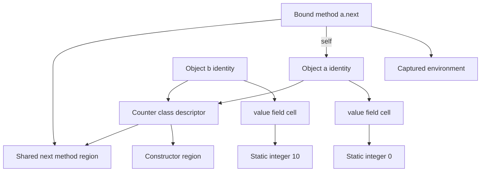

# Black Box graph runtime

Black Box is an alternative execution backend in this repository. It keeps the
existing BLBX lexer, parser, checker, syntax, and IR. The graph path begins after
`ir.Lower`:

```text
source → lexer → parser/checker → IR → graph builder → graph evaluator
```

Build it with `go build -o bin/blackbox.exe ./cmd/blackbox`, then run
`bin/blackbox.exe run examples/graph_execution.bx`. The normal BLBX executable
also provides `run-graph`; `blbx run` remains the original interpreter.

Execution preserves imperative behavior: an explicit function call executes
when reached even if its result is discarded. The graph determines which
control paths are active; assignments are not lazy.

The backend is now a hybrid: declarative scalar value dependencies plus explicitly
ordered effects. This does not introduce reactive assignment or immutable source
variables. Reassignment updates the existing BLBX binding while creating a new
value version for calculations that can safely use it.

## Graph components

Each expression becomes an addressable component with a stable node ID, source
location, operation, and named input ports. Edges have explicit roles:

| Edge | Role |
| --- | --- |
| Value | Supplies an operand or computed result |
| Control | Selects which region is activated |
| Effect | Orders reads, writes, allocation, I/O, and other observable actions |
| Reference | Points to an environment, object, class, or callable identity |

Integer, float, string, and boolean literals are decoded into static leaf nodes
when the graph is built. Identical literals share one node; their source uses
are recorded separately. Traversal reads their state without parsing or
recomputing it. The existing `null` name retains BLBX name-lookup behavior.
Arrays and objects require allocation components:
sharing their initializer graph must not accidentally share their mutable state.

Names connect through environment cells. A general read obtains the cell's value
at its ordered execution point. Within a straight-line region, a proven scalar
binding can instead be read through an immutable `VALUE_REF` to its completed
assignment. Reassignment creates a different version. Consequently,
`x = x.add(1)` depends on x's earlier version, not on itself.

## Declarative values and binding versions

```text
x = 10
y = 20
first = x.add(y)
second = x.add(y)
x = 40
later = x.add(y)
print(first, second, later) // 30, 30, 60 on separate lines
```

The first two additions share a value identity because they depend on the same
immutable versions of x and y. The last addition refers to a new x version.
Previous results keep their original values. There is no automatic recomputation
when a variable changes, and a version read never reruns its defining assignment.

The compiler conservatively proves scalar types and purity for selected builtin
arithmetic, comparisons, boolean and bitwise operations, string methods, and
`ord`/`typeof`. Equivalent pure occurrences retain their own source locations but
share one value identity. The VM memoizes successful results per activation.
It does not cache errors or hoist calculations out of their active control paths.

Effectful producers can feed the value graph too:

```text
letter = input()
code = ord(letter)
first = code.add(1)
second = code.add(1)
print(first, second)
```

The input call runs once as an ordered effect. Its resulting string becomes an
immutable version; the downstream scalar calculations can be shared. Inferring a
producer's result type does not make that producer pure or remove it from execution.

Unknown calls invalidate assumptions about existing mutable name bindings. Object
and array reads, allocation, imports, user-defined methods, and other unknown
calls remain ordered operations. Object overloads are never replaced with scalar
arithmetic. Scalar versions are not propagated across branch merges, loop
iterations, or closure boundaries. Loops, function calls, and workers use fresh
region activations; a saved closure continues to read its captured environment.

## Traversal and normalization

Evaluation starts at a demanded program result or effect root. An operation
recursively requests only the inputs required by its semantics. Program and
block regions demand their final step, first resolving its `effect-in`
prerequisites. A step's completion token prevents duplicate execution within
that activation. The scheduler uses an explicit stack for these dependencies;
forward `next` links remain only for navigation.
Loops follow explicit `LOOP_GATE` back-edges. A loop iteration and a recursive
call have fresh evaluation state; a node ID alone is never a valid cache key
for dynamic results. The current implementation uses Go recursion for nested
expressions and calls, and iterative traversal for statement sequences and loops.

The graph builder normalizes object-shaped IR blocks into allocation components,
member and indexed calls into explicit invocation components, and sequences and
loops into connected control regions. Reads, writes, member lookups, branches,
and completions retain their distinct operations. Traversal preserves source
evaluation order, single evaluation of operands, and dynamic method dispatch.
For example,
`a.add(b)` must not become primitive addition unless the receiver type and
absence of an overriding method are proven. Only calculations whose complete
dependencies are proven pure scalar values receive reusable value identities.

Call arguments have their own ordered demand regions. Receiver and arity checks
still happen before argument evaluation when BLBX requires it. Boolean operators
and branches demand only selected inputs. Argument effects run left to right,
even inside an expression whose final result is discarded. A failure or control
completion prevents later effects from running. Retaining conservative ordering
also preserves failure timing for unused pure expressions.

An `if` requests its condition and activates only the selected callback region.
Boolean `and` and `or` request the right operand only when required. A `while`
reactivates its condition after each iteration; it cannot reuse a previous
condition result. `for` requests one iterator step at a time. Return, assert,
break, continue, and failure propagate as completion signals. They stop or
redirect traversal at BLBX's function and control-statement boundaries.

Function bodies and loop bodies form reusable regions with input/output
connections. Recursive calls use separate scopes and execution frames. Cyclic
objects are reference cycles, not requests to evaluate their fields recursively.
There is no general strongly-connected-component or fixed-point solver.

## Classes and objects

A class value points to a class descriptor: base-class references, C3 method
resolution order, interface contracts, a captured environment, field initializer
regions, constructor region, and method templates. Class declaration itself is
an executable component because bases and captured bindings are runtime values.

An object is an identity node with a field-name-to-cell table and an optional
class reference. A plain object has the same representation without a class.
Each cell points to its current value. Two variables referencing one object
observe the same field updates. Distinct constructor calls allocate distinct
identities and distinct mutable defaults.

```text
class Counter {
    (start) => { self.value = start }
    next = () => {
        self.value = self.value.add(1)
        return self.value
    }
}
a = Counter(0)
b = Counter(10)
print(a.next())
```



The diagram shows state before the call. Traversing `a.next()` creates a method
activation, reads a's cell, demands addition with static `1`, and writes the
result back to a's cell. The old literal remains unchanged. Object b is unaffected.
The later return reads the updated cell through an effect dependency.

Method code can be shared, but each method closure retains its correct instance
environment and declaring class. Extracting `method = a.next` retains a's
identity. `super` is a reference containing receiver and declaring-class position
in the actual instance's C3 order, not a second parent object. Preserve BLBX's
per-declaring-class field layers for `super.name` access.

Construction traverses field initializers in reverse MRO, binds methods to their
declaring classes, invokes the selected constructor, then checks interface
contracts. Constructor return values do not replace the instance. Explicit
`super(...)` traverses the next constructor using the same receiver identity.

## Effects and selected paths

A program region demands its ordered statements even when their result values
are unused. Explicit calls run, assignments write immediately, and exceptions
remain observable. Unselected branches, short-circuited operands, and uncalled
function bodies remain unevaluated.

```text
unused = print("hello")
x = 1
y = x.add(1)
x = 2
print(y)
```

This prints `hello` and then `2`, exactly as on the original backend.
An unused return value never removes a call from the execution path.

Native library operations are graph-invoked Go primitives. Imports compile their
source to graphs before execution. Task workers share immutable code graphs and
snapshot mutable values and captured environments; they do not delegate to the
IR interpreter. Unknown method calls retain dynamic dispatch and effect order.

Expressions can be first-class components inside the runtime without introducing
new syntax. Exposing graph inspection, expression quotation, or graph rewriting
to BLBX programs is a separate language/API decision; it is not implied by the
existing first-class function syntax.

## Implementation and inspection

- [Graph builder](../runtime/graph/graph.go): addressable components, literal
  sharing, normalization, control regions, and JSON graph serialization.
- [Value/effect analysis](../runtime/graph/values.go): conservative scalar type
  inference, binding versions, shared value identities, and argument plans.
- [Effect scheduler](../runtime/graphvm/effects.go): prerequisite tokens,
  activation-local versions, and ordered argument demands.
- [Graph VM](../runtime/graphvm/vm.go): graph traversal and imperative execution.
- [Class construction](../runtime/graphvm/class.go) and
  [inheritance](../runtime/graphvm/inheritance.go): instance state, method
  binding, interface validation, and C3 lookup using graph-backed bodies.
- [Task workers](../runtime/graphvm/task.go): isolated state and shared graph code.
- [Black Box executable](../cmd/blackbox/main.go): graph execution using the
  existing frontend and CLI checking behavior.

Use `blackbox graph examples/graph_execution.bx` to inspect the compiled graph.
The JSON is a flat node table whose edges refer to IDs, so sharing and loop cycles
remain visible. This is a code graph, not a dump of runtime objects or captured
state. IDs are local to each compiled module. `VM.Trace` is an optional Go
callback invoked for visited components; `VM.Visits` counts visits. Task workers
have independent VMs and do not inherit tracing callbacks.

`VM.ValueComputations` and `VM.ValueCacheHits` count successful nonliteral pure
computations and reused values. `VM.EffectSteps` counts executed sequence and
argument steps, including conservative ordering steps for pure values. JSON
nodes expose `pure`, `valueType`, and `effect`, with `definition`, `shared-value`,
and `effect-in` edges making the value/effect boundary inspectable.

The graph VM's value, scope, class, and native-library code was adapted from the
existing runtime to preserve behavior. It is an independent implementation:
there are no calls into `runtime/interpreter`. Changes to language behavior or
native APIs must currently be maintained in both backends.

## Verification and limits

Run [graph_execution.bx](../examples/graph_execution.bx) with either backend.
It checks discarded-return side effects, skipped branches, changing loop state,
recursive calls, object aliases, independent instance defaults, bound methods,
closures, and errors. The existing examples also cover inheritance, interfaces,
formatted strings, collection mutation, native libraries, networking, and tasks.

Run [declarative_values.bx](../examples/declarative_values.bx) for binding versions,
shared calculations, nested effect ordering, mutation, and closure boundaries.

This is a conservative hybrid backend, not a performance claim. Purity inference
does not analyze arbitrary user/native functions or unknown parameter types;
unsupported cases remain ordered rather than being speculatively optimized.
There is no reactive propagation, automatic parallel scheduling, or universal
laziness. Nested expression and function evaluation still uses the host call
stack. It inherits the original runtime's documented
scope and parameter-validation limits. Expression components are inspectable
inside the backend; no new source-level quotation or graph-rewriting syntax has
been introduced. Existing `.bx` programs need no syntax changes.
